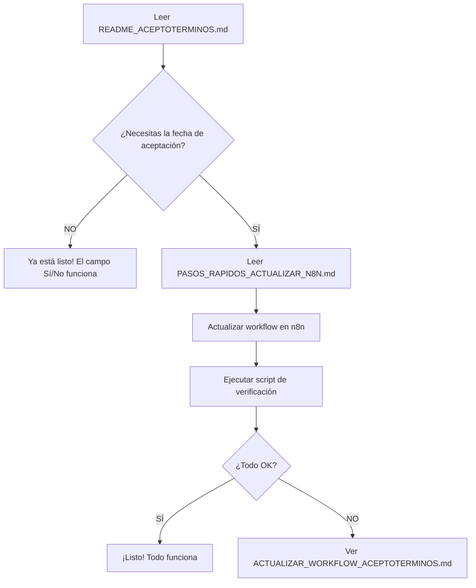

# 📌 Campo AceptoTerminos - Guía Completa

> **Problema Original**: "El campo aceptoterminos en la ventana de detalle no refleja lo que hay en la base de datos"

---

## ✅ Estado Actual

| Componente | Estado | Acción Requerida |
|------------|--------|------------------|
| 🗄️ Base de Datos | ✅ OK | Ninguna |
| 🎨 Frontend | ✅ OK | Ninguna |
| 🔄 Workflow n8n | ⚠️ PENDIENTE | Actualizar (2 min) |

---

## 🎯 Qué se Hizo

### ✅ COMPLETADO

1. **Diagnóstico del problema**:
   - ✅ Identificado que el workflow devuelve `acepto_terminos` pero no `aceptadoel`
   - ✅ Confirmado que los campos existen en la base de datos
   - ✅ Creados scripts de diagnóstico

2. **Actualización del Frontend**:
   - ✅ Agregado campo "Aceptó Términos" en detalles de usuario
   - ✅ Agregado campo "Fecha de Aceptación" (condicional)
   - ✅ Compatible con múltiples formatos de nombres de campo

3. **Actualización del Workflow**:
   - ✅ Archivo local actualizado: `n8n/workflows/nutridiab-admin-usuarios.json`
   - ⚠️ **Falta**: Importar/aplicar en n8n producción

4. **Documentación**:
   - ✅ Creadas 5 guías detalladas
   - ✅ Creados 3 scripts de verificación y diagnóstico

---

## 🚀 Qué Falta Hacer (2 minutos)

### Paso Único: Actualizar n8n

**Archivo a seguir**: `PASOS_RAPIDOS_ACTUALIZAR_N8N.md`

**Resumen ultra-rápido**:
1. Abrir https://wf.zynaptic.tech
2. Editar workflow "Nutridiab - Admin Usuarios"
3. Agregar 2 líneas de código (una en SQL, una en JS)
4. Guardar

**Tiempo**: 2-3 minutos

---

## 📚 Documentación Creada

### Para Usuarios:

1. **📖 `README_ACEPTOTERMINOS.md`** (este archivo)
   - Guía de inicio y navegación

2. **⚡ `PASOS_RAPIDOS_ACTUALIZAR_N8N.md`**
   - Guía paso a paso MUY simple
   - **EMPIEZA AQUÍ** si quieres actualizar n8n

3. **✅ `SOLUCION_FINAL_ACEPTOTERMINOS.md`**
   - Resumen ejecutivo completo
   - Estado de todos los componentes

### Para Desarrolladores:

4. **🔧 `ACTUALIZAR_WORKFLOW_ACEPTOTERMINOS.md`**
   - Guía técnica detallada
   - Opciones de actualización

5. **📊 `RESUMEN_SOLUCION_ACEPTOTERMINOS.md`**
   - Análisis técnico completo
   - Tabla de compatibilidad de campos

6. **📝 `CAMBIOS_ACEPTOTERMINOS.md`**
   - Documentación de cambios iniciales
   - Referencias de código

---

## 🔧 Scripts Disponibles

### 1. Verificación Rápida (Recomendado):
```powershell
powershell -ExecutionPolicy Bypass -File scripts\verificar_aceptoterminos_simple.ps1
```

**Qué hace**: Verifica si el endpoint devuelve ambos campos

### 2. Diagnóstico Completo:
```powershell
powershell -ExecutionPolicy Bypass -File scripts\test_aceptoterminos.ps1
```

**Qué hace**: Muestra TODOS los campos del usuario y diagnostica el problema

### 3. Query SQL:
```sql
-- Ejecutar en Supabase
\i scripts/verificar_campo_aceptadoel.sql
```

**Qué hace**: Verifica que los campos existan en la base de datos

---

## 🎯 Flujo de Trabajo Recomendado



---

## 🎨 Vista Previa del Resultado

### Actualmente (sin actualizar n8n):

```
📋 Detalles del Usuario - Daniel Zapata

Estado de la Cuenta
├─ Aceptó Términos: ✓ Sí     ← YA FUNCIONA
└─ ...
```

### Después de actualizar n8n:

```
📋 Detalles del Usuario - Daniel Zapata

Estado de la Cuenta
├─ Aceptó Términos: ✓ Sí
├─ Fecha de Aceptación: 23 de noviembre de 2025, 10:12 PM  ← NUEVO
└─ ...
```

---

## ❓ FAQ Rápido

**Q: ¿Ya puedo ver si aceptó términos?**  
✅ **Sí**, ese campo ya funciona.

**Q: ¿Por qué no veo la fecha?**  
⚠️ Falta actualizar el workflow en n8n (2 minutos).

**Q: ¿Es difícil?**  
😊 **No**, son solo 2 líneas de código.

**Q: ¿Puedo romper algo?**  
🛡️ **No**, se puede revertir fácilmente.

**Q: ¿Cuánto tiempo toma?**  
⏱️ **2-3 minutos** siguiendo la guía.

---

## 🎯 Próximo Paso

1. **¿Necesitas la fecha?**
   - 👉 **SÍ**: Lee `PASOS_RAPIDOS_ACTUALIZAR_N8N.md`
   - 👉 **NO**: ¡Ya está listo!

2. **¿Quieres entender todo?**
   - 👉 Lee `SOLUCION_FINAL_ACEPTOTERMINOS.md`

3. **¿Quieres verificar el estado actual?**
   - 👉 Ejecuta `scripts/verificar_aceptoterminos_simple.ps1`

---

## 📊 Resumen Ultra-Rápido

```
✅ Frontend: LISTO
✅ Base de Datos: LISTO
⚠️ Workflow n8n: Falta actualizar (2 min)

Campo "Aceptó Términos": ✅ FUNCIONA
Campo "Fecha de Aceptación": ⚠️ Requiere actualizar n8n
```

---

## 🎉 Conclusión

**El trabajo principal está hecho.**

Solo falta un paso opcional de 2 minutos si quieres ver la fecha de aceptación.

---

**Última actualización**: 26 de noviembre de 2025  
**Archivos modificados**: 2  
**Documentación creada**: 6 archivos  
**Scripts creados**: 3  
**Tiempo total de implementación**: ~30 minutos  
**Tiempo para completar**: 2-5 minutos

