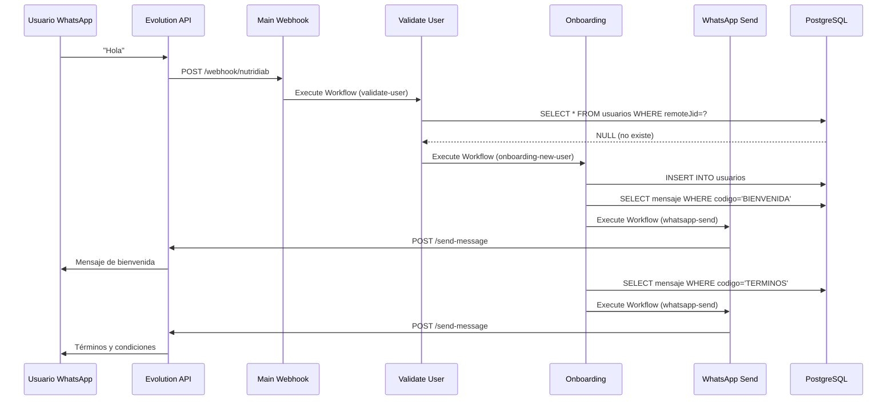
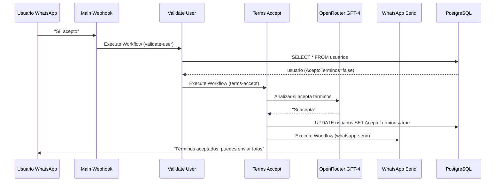
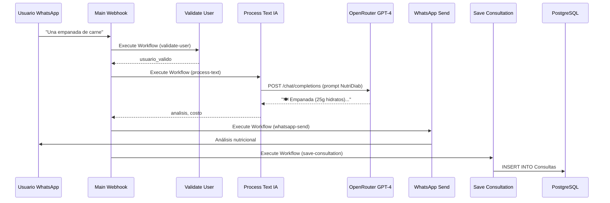
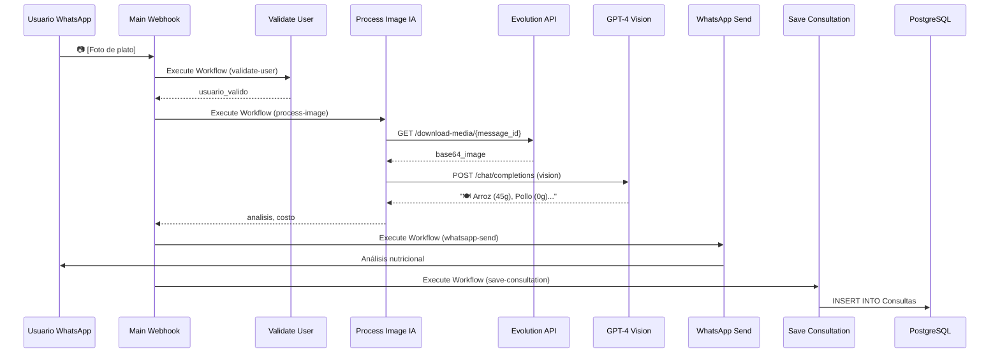
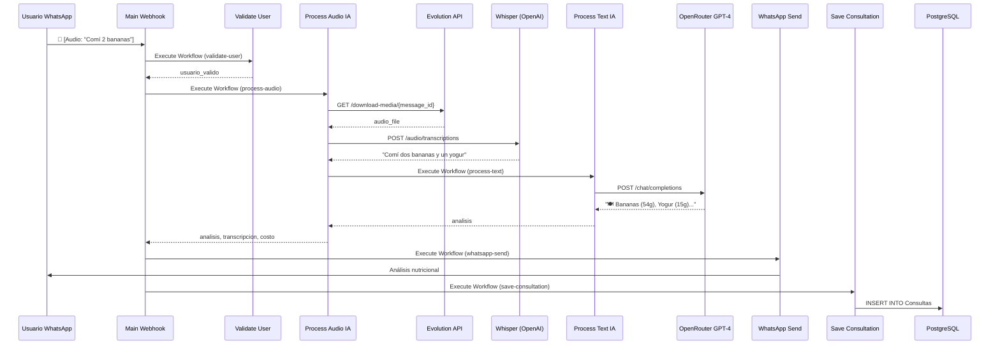

# 🏗️ Arquitectura Modular NutriDiab - Propuesta Detallada

## 📐 Diagrama de Arquitectura General

```
┌──────────────────────────────────────────────────────────────────────────┐
│                          WHATSAPP (Usuario Final)                        │
│                     "Hola, comí una empanada"                            │
└────────────────────────────────┬─────────────────────────────────────────┘
                                 │
                                 ▼
┌──────────────────────────────────────────────────────────────────────────┐
│                        EVOLUTION API (Gateway)                           │
│                  Recibe mensaje y envía webhook a n8n                   │
└────────────────────────────────┬─────────────────────────────────────────┘
                                 │
                                 ▼
╔══════════════════════════════════════════════════════════════════════════╗
║                   🎯 WORKFLOW PRINCIPAL (Orquestador)                    ║
║                    nutridiab-main-webhook.json                           ║
╚════════════════════════════════╦═════════════════════════════════════════╝
                                 ║
                    ┌────────────┼────────────┐
                    ▼            ▼            ▼
        ┌───────────────────────────────────────────┐
        │  ¿Usuario nuevo?  │  ¿Aceptó términos?   │
        └───────┬───────────┴───────────┬───────────┘
                │                       │
                ▼                       ▼
    ╔═══════════════════╗   ╔═══════════════════════╗
    ║   ONBOARDING      ║   ║  VALIDAR TÉRMINOS     ║
    ║   (Sub-workflow)  ║   ║  (Sub-workflow)       ║
    ╚═══════════════════╝   ╚═══════════════════════╝
                │                       │
                └───────────┬───────────┘
                            ▼
                ┌───────────────────────┐
                │  ¿Tipo de mensaje?    │
                └───┬───────┬───────┬───┘
                    │       │       │
        ┌───────────┼───────┼───────┼───────────┐
        ▼           ▼       ▼       ▼           ▼
    ╔═══════╗  ╔═══════╗  ╔═══════╗  ╔═══════╗
    ║ TEXTO ║  ║ IMAGEN║  ║ AUDIO ║  ║ VIDEO ║
    ║  IA   ║  ║  IA   ║  ║  IA   ║  ║  IA   ║
    ╚═══╤═══╝  ╚═══╤═══╝  ╚═══╤═══╝  ╚═══╤═══╝
        └───────────┼───────┼───────┼───────────┘
                    ▼       ▼       ▼
        ┌────────────────────────────────────┐
        │   Análisis Nutricional Completo    │
        │   (hidratos, calorías, info)       │
        └────────────────┬───────────────────┘
                         ▼
            ╔═════════════════════╗
            ║  ENVIAR RESPUESTA   ║
            ║   WhatsApp Service  ║
            ║   (Sub-workflow)    ║
            ╚══════════╦══════════╝
                       ║
            ╔══════════╩══════════╗
            ║ GUARDAR CONSULTA    ║
            ║  Database Service   ║
            ║   (Sub-workflow)    ║
            ╚══════════╦══════════╝
                       ║
            ╔══════════╩══════════╗
            ║  AUDIT LOG          ║
            ║   (Sub-workflow)    ║
            ╚═════════════════════╝
```

---

## 🔄 Flujo Detallado por Escenario

### Escenario 1: Usuario Nuevo



### Escenario 2: Usuario Debe Aceptar Términos



### Escenario 3: Análisis de Texto



### Escenario 4: Análisis de Imagen



### Escenario 5: Análisis de Audio



---

## 📦 Estructura de Sub-Workflows y sus Contratos

### 1. nutridiab-service-validate-user

**Tipo**: Sub-workflow reutilizable
**Trigger**: Execute Workflow Trigger

**Inputs**:
```json
{
  "remoteJid": "5491155555555@s.whatsapp.net",
  "mensaje": "texto del mensaje",
  "tipo": "texto|imagen|audio"
}
```

**Outputs**:
```json
{
  "usuario": {
    "usuario ID": 123,
    "nombre": "Juan",
    "AceptoTerminos": true,
    "remoteJid": "5491155555555@s.whatsapp.net"
  },
  "valido": true,
  "necesita_onboarding": false,
  "necesita_aceptar_terminos": false
}
```

**Lógica**:
```
1. Buscar usuario por remoteJid
2. IF no existe:
   - necesita_onboarding = true
   - Execute Workflow: onboarding-new-user
3. ELSE IF no aceptó términos:
   - necesita_aceptar_terminos = true
   - Execute Workflow: terms-accept
4. ELSE:
   - valido = true
5. Return usuario, flags
```

---

### 2. nutridiab-onboarding-new-user

**Tipo**: Sub-workflow
**Trigger**: Execute Workflow Trigger

**Inputs**:
```json
{
  "remoteJid": "5491155555555@s.whatsapp.net",
  "username": "Juan Perez"
}
```

**Outputs**:
```json
{
  "usuario_nuevo": {
    "usuario ID": 123,
    "remoteJid": "5491155555555@s.whatsapp.net",
    "AceptoTerminos": false
  },
  "mensajes_enviados": ["BIENVENIDA", "SERVICIO", "TERMINOS", "ACEPTA"]
}
```

**Lógica**:
```
1. INSERT INTO usuarios (remoteJid, AceptoTerminos=false)
2. Leer mensajes de BD:
   - BIENVENIDA
   - SERVICIO
   - TERMINOS
   - ACEPTA
3. FOR cada mensaje:
   - Execute Workflow: whatsapp-send
   - Wait 2 segundos (no saturar)
4. Return usuario_nuevo
```

---

### 3. nutridiab-onboarding-terms-accept

**Tipo**: Sub-workflow
**Trigger**: Execute Workflow Trigger

**Inputs**:
```json
{
  "usuario_id": 123,
  "mensaje": "sí acepto los términos"
}
```

**Outputs**:
```json
{
  "terminos_aceptados": true,
  "mensaje_respuesta": "Excelente! Ya puedes enviar fotos..."
}
```

**Lógica**:
```
1. IF mensaje no es texto:
   - Return "Debes responder con texto"
2. Analizar con IA: ¿acepta términos?
   - Prompt: "Analiza si este mensaje acepta términos: '{mensaje}'"
3. IF acepta:
   - UPDATE usuarios SET AceptoTerminos=true, aceptadoel=NOW()
   - Leer mensaje: CUANDO_ACEPTA
   - Execute Workflow: whatsapp-send
4. ELSE:
   - Leer mensaje: RESPONDE_OTRA_COSA
   - Execute Workflow: whatsapp-send
5. Return resultado
```

---

### 4. nutridiab-ai-process-text

**Tipo**: Sub-workflow IA
**Trigger**: Execute Workflow Trigger

**Inputs**:
```json
{
  "texto": "Una empanada de carne al horno",
  "usuario_id": 123,
  "contexto_conversacion": [] // opcional, para memoria LangChain
}
```

**Outputs**:
```json
{
  "analisis_nutricional": "🍽️ **Alimentos detectados:**\n- Empanada...",
  "costo": 0.0025,
  "tokens_usados": {
    "input": 150,
    "output": 200
  }
}
```

**Lógica**:
```
1. Verificar saldo OpenRouter (GET /api/v1/credits)
2. Preparar prompt con sistema NutriDiab
3. POST a OpenRouter:
   - Model: openai/gpt-4-turbo
   - Messages: [system, user]
   - Temperature: 0.7
4. Calcular costo (saldo_antes - saldo_después)
5. Return análisis, costo
```

**Prompt del Sistema**:
```
Eres **NutriDiab**, un asistente de IA especializado en nutrición 
para personas con diabetes tipo 1 y 2. 

Tu misión es estimar los hidratos de carbono presentes en alimentos 
a partir de descripciones de texto.

Reglas:
1. Analiza los alimentos descritos
2. Estima porciones y hidratos por ítem
3. Usa bases nutricionales estándar (USDA, FAO, BEDCA)
4. Devuelve respuesta en texto natural, empática y clara

Formato de respuesta:
---
🍽️ **Alimentos detectados:** [lista con peso y gramos de hidratos]
🔢 **Total de hidratos:** [valor total en gramos]
💬 **Comentario:** [explicación educativa]
📊 **Nivel de confianza:** [baja / media / alta]
⚠️ **Advertencia:** Esta información es orientativa.
---

Mantén un tono cercano, tranquilo y educativo.
No des diagnósticos ni ajustes de medicación.
```

---

### 5. nutridiab-ai-process-image

**Tipo**: Sub-workflow IA
**Trigger**: Execute Workflow Trigger

**Inputs**:
```json
{
  "message_id": "3A1234567890ABCDEF",
  "usuario_id": 123,
  "remoteJid": "5491155555555@s.whatsapp.net",
  "server_url": "https://evolution.example.com",
  "instance": "nutridiab",
  "apikey": "xxxxx"
}
```

**Outputs**:
```json
{
  "analisis_nutricional": "🍽️ **Alimentos detectados:**...",
  "costo": 0.025,
  "imagen_procesada": true
}
```

**Lógica**:
```
1. Descargar imagen de WhatsApp:
   - GET {server_url}/message/downloadMediaMessage/{instance}
   - Headers: { apikey }
   - Body: { key: { id: message_id, remoteJid } }
   - Retry: 5 intentos con 5s delay
2. Convert base64 a binario (Convert to File node)
3. Verificar saldo OpenRouter
4. POST a OpenRouter GPT-4 Vision:
   - Model: openai/gpt-4-vision-preview
   - Messages: [
       {
         role: "user",
         content: [
           { type: "text", text: prompt_sistema },
           { type: "image_url", image_url: { url: "data:image/jpeg;base64,..." } }
         ]
       }
     ]
5. Calcular costo
6. Return análisis, costo
```

---

### 6. nutridiab-ai-process-audio

**Tipo**: Sub-workflow IA
**Trigger**: Execute Workflow Trigger

**Inputs**:
```json
{
  "message_id": "3A1234567890ABCDEF",
  "usuario_id": 123,
  "remoteJid": "5491155555555@s.whatsapp.net",
  "server_url": "https://evolution.example.com",
  "instance": "nutridiab",
  "apikey": "xxxxx"
}
```

**Outputs**:
```json
{
  "analisis_nutricional": "🍽️ **Alimentos detectados:**...",
  "transcripcion": "Comí dos bananas y un yogur",
  "costo_total": 0.015,
  "desglose_costos": {
    "transcripcion": 0.005,
    "analisis": 0.010
  }
}
```

**Lógica**:
```
1. Descargar audio de WhatsApp:
   - GET {server_url}/message/downloadMediaMessage/{instance}
   - Retry: 5 intentos con 5s delay
2. Convert base64 a binario (Convert to File node)
3. Transcribir con OpenAI Whisper:
   - POST https://api.openai.com/v1/audio/transcriptions
   - Model: whisper-1
   - File: audio_file
4. Guardar costo de transcripción
5. Execute Workflow: nutridiab-ai-process-text
   - Input: { texto: transcripcion, usuario_id }
6. Sumar costos (transcripción + análisis)
7. Return análisis, transcripción, costo_total
```

---

### 7. nutridiab-service-whatsapp-send

**Tipo**: Sub-workflow servicio
**Trigger**: Execute Workflow Trigger

**Inputs**:
```json
{
  "remoteJid": "5491155555555@s.whatsapp.net",
  "mensaje": "Hola! Bienvenido a NutriDiab",
  "server_url": "https://evolution.example.com",
  "instance": "nutridiab",
  "apikey": "xxxxx"
}
```

**Outputs**:
```json
{
  "enviado": true,
  "message_id": "3EB0ABCDEF1234567890",
  "timestamp": "2025-11-26T10:30:00Z"
}
```

**Lógica**:
```
1. POST {server_url}/message/sendText/{instance}
   - Headers: { apikey }
   - Body: {
       number: remoteJid,
       text: mensaje
     }
   - Retry on fail: 5 intentos, 5s delay
2. IF error:
   - Execute Workflow: error-handler
3. Return resultado
```

---

### 8. nutridiab-service-save-consultation

**Tipo**: Sub-workflow servicio
**Trigger**: Execute Workflow Trigger

**Inputs**:
```json
{
  "usuario_id": 123,
  "tipo": "texto|imagen|audio",
  "resultado": "🍽️ **Alimentos detectados:**...",
  "costo": 0.0025,
  "metadata": {
    "tokens": { "input": 150, "output": 200 },
    "model": "gpt-4-turbo"
  }
}
```

**Outputs**:
```json
{
  "consulta_id": 456,
  "guardado": true
}
```

**Lógica**:
```
1. INSERT INTO nutridiab.Consultas
   - tipo
   - usuario ID
   - resultado
   - Costo
   - created_at = NOW()
2. Execute Workflow: audit-log
   - evento: "consulta_guardada"
   - usuario_id
   - detalles: { tipo, costo }
3. Return consulta_id
```

---

### 9. nutridiab-service-calculate-cost

**Tipo**: Sub-workflow servicio
**Trigger**: Execute Workflow Trigger

**Inputs**:
```json
{
  "saldo_inicial": 10.5,
  "saldo_final": 10.4975
}
```

**Outputs**:
```json
{
  "costo": 0.0025
}
```

**Lógica**:
```
1. costo = saldo_inicial - saldo_final
2. Round a 6 decimales
3. Return costo
```

---

### 10. nutridiab-service-error-handler

**Tipo**: Sub-workflow servicio
**Trigger**: Execute Workflow Trigger

**Inputs**:
```json
{
  "error_tipo": "api_timeout",
  "error_mensaje": "OpenRouter no responde",
  "contexto": {
    "workflow": "nutridiab-ai-process-text",
    "usuario_id": 123,
    "remoteJid": "5491155555555@s.whatsapp.net"
  }
}
```

**Outputs**:
```json
{
  "mensaje_usuario": "Lo siento, hubo un problema. Intenta más tarde.",
  "logged": true,
  "notificado_admin": true
}
```

**Lógica**:
```
1. Log error en tabla errors:
   - INSERT INTO errors (tipo, mensaje, contexto, timestamp)
2. Execute Workflow: audit-log
3. Generar mensaje amigable según tipo de error:
   - api_timeout: "Servicio temporalmente no disponible"
   - insufficient_funds: "Límite de uso alcanzado"
   - invalid_input: "Por favor envía un mensaje válido"
   - default: "Error inesperado, ya lo estamos revisando"
4. IF error crítico:
   - Notificar admin por email/WhatsApp
5. Return mensaje_usuario
```

---

### 11. nutridiab-service-audit-log

**Tipo**: Sub-workflow servicio
**Trigger**: Execute Workflow Trigger

**Inputs**:
```json
{
  "evento": "consulta_guardada",
  "usuario_id": 123,
  "detalles": {
    "tipo": "texto",
    "costo": 0.0025
  }
}
```

**Outputs**:
```json
{
  "log_id": 789,
  "timestamp": "2025-11-26T10:30:00Z"
}
```

**Lógica**:
```
1. INSERT INTO audit_logs
   - evento
   - usuario_id
   - detalles (JSONB)
   - created_at = NOW()
2. Return log_id
```

---

## 🔧 Configuración de Nodos n8n

### Execute Workflow Node (Llamar Sub-workflow)

**Configuración**:
```json
{
  "mode": "Run once with all items",
  "source": "database", // o "parameter" para workflow local
  "workflowId": "ID_DEL_SUBWORKFLOW",
  "waitForCompletion": true, // false para async
  "options": {
    "specifyInputData": true,
    "inputData": {
      "remoteJid": "={{ $json.remoteJid }}",
      "mensaje": "={{ $json.mensaje }}"
    }
  }
}
```

### Execute Workflow Trigger (Entrada de Sub-workflow)

**Configuración**:
```json
{
  "mode": "manual",
  "inputFields": {
    "fields": [
      {
        "name": "remoteJid",
        "type": "string",
        "required": true,
        "description": "ID de WhatsApp del usuario"
      },
      {
        "name": "mensaje",
        "type": "string",
        "required": true,
        "description": "Texto del mensaje"
      }
    ]
  }
}
```

---

## 📊 Ventajas de Esta Arquitectura

### 1. **Modularidad Extrema**
- ✅ 12 sub-workflows reutilizables
- ✅ Cada uno con responsabilidad única
- ✅ Fácil de testear en aislamiento

### 2. **Escalabilidad**
- ✅ Agregar nuevo tipo de mensaje: crear sub-workflow
- ✅ Cambiar proveedor IA: modificar solo el sub-workflow de IA
- ✅ No afecta el resto del sistema

### 3. **Mantenibilidad**
- ✅ Cambios localizados
- ✅ No hay código duplicado
- ✅ Contratos claros entre workflows

### 4. **Performance**
- ✅ Sub-workflows pequeños se ejecutan rápido
- ✅ Liberan workers rápidamente
- ✅ Ejecuciones asíncronas donde sea posible

### 5. **Costos**
- ✅ Sub-workflows NO cuentan en límite de ejecuciones
- ✅ Modularizar es gratis en n8n

### 6. **Debugging**
- ✅ Ver exactamente qué sub-workflow falla
- ✅ Logs detallados por módulo
- ✅ Fácil reproducir errores

---

## 🚀 Siguiente Paso

Revisar esta propuesta y comenzar implementación siguiendo el plan de 5 fases del documento `ANALISIS_MODULARIZACION_NUTRIDIAB.md`.

---

**Documento generado**: 2025-11-26
**Versión**: 1.0

